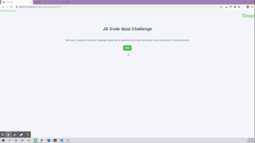

#Homework 4: Javascript Code Quiz

## Project Overview 

The purpose of this assignment is to create a timed multiple-choice quiz using dynamically updated updated HTML and CSS powered by Javascript.

## User Story

AS A coding oot camp studnet
I WANT to take a timed quiz on Javascript fundamentls that stores high scores
SO THAT I can qauge my progress compared to my peers

## Frameworks

* Bootstrap

## Issues 

I am still having trouble with local storage.

## Future Version 

* Fourth page with more movie details and a viewable trailer
* More Mood options to choose from
* The ability to select multiple genres at once
* Option to output different/random list of selected genre of movies
* User pick filter
* Use of search option
* Easier & quicker shortcut buttons for user to navigate throughout all pages
* Footbar emojis that links to seasonal suggested movies

## License 
None 
